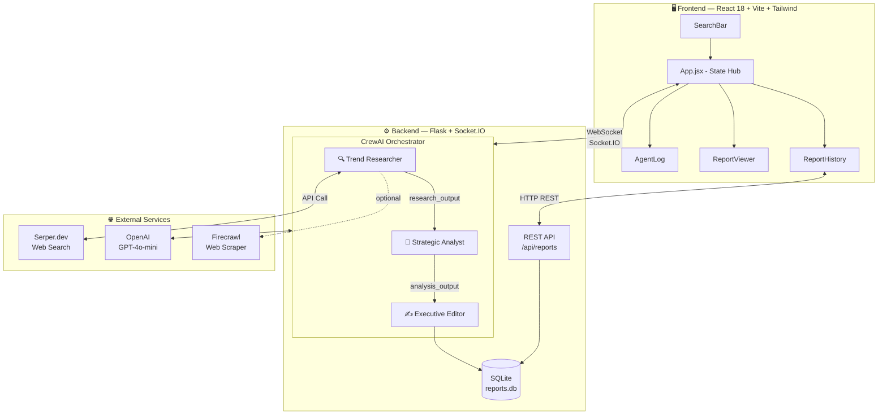
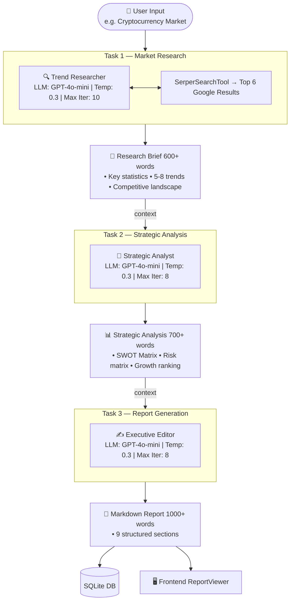
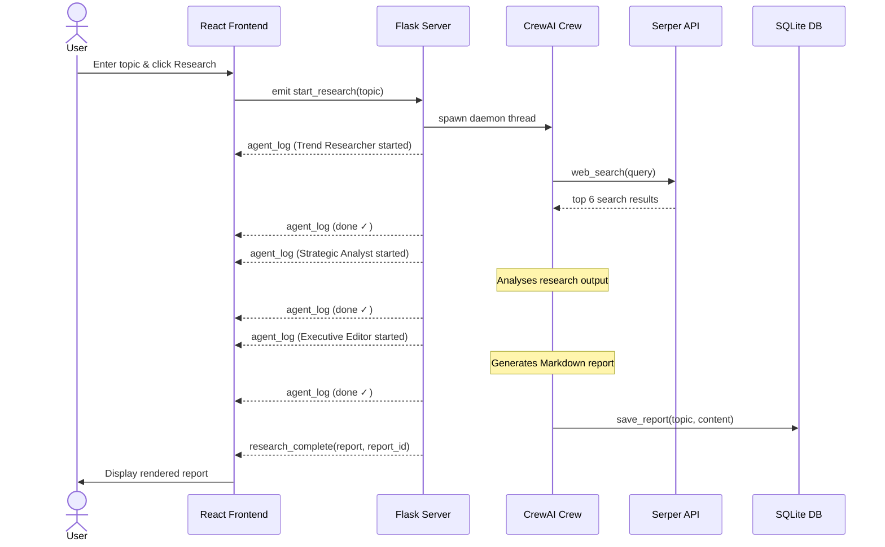
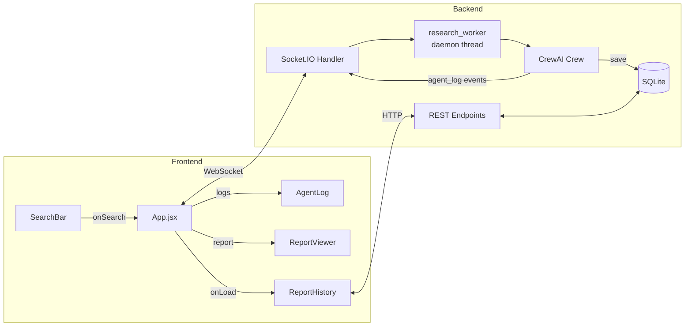

# Synapse – Agentic AI Market Research System

> A multi-agent AI system that autonomously conducts deep market research,
> performs SWOT analysis, and generates professional reports — powered by
> **CrewAI + OpenAI GPT-4o + Flask + React**.

---

## Architecture

### High-Level System Overview



### Agent Pipeline



### Real-Time Data Flow



### Component Interaction



> Full system design with detailed diagrams → [SYSTEM_DESIGN.md](SYSTEM_DESIGN.md)

---

## Prerequisites

| Tool | Purpose | Install |
|---|---|---|
| Python 3.10+ | Backend runtime | python.org |
| Node.js 18+ | Frontend runtime | nodejs.org |
| OpenAI API key | GPT-4o access | platform.openai.com |

---

## Setup & Installation

### 1. Clone / Open the project

```bash
cd "SYNAPSE-AGENTIC-AI-MARKET-RESEARCH-SYSTEM"
```

### 2. Backend Setup

```bash
cd backend
python -m venv venv
venv\Scripts\activate          # Windows
# source venv/bin/activate     # macOS/Linux

pip install -r requirements.txt

# Configure environment
copy .env.example .env
# Edit .env and add your OPENAI_API_KEY, SERPER_API_KEY and FIRECRAWL_API_KEY

python app.py
```

Backend runs at: `http://localhost:5000`

### 3. Frontend Setup

```bash
cd frontend
npm install

# Configure environment
copy .env.example .env
# Edit .env if backend URL is different

npm run dev
```

Frontend runs at: `http://localhost:3000`

---

## Getting Free API Keys

| Service | Free Tier | Link |
|---|---|---|
| Serper.dev | 2,500 searches/month | serper.dev |
| Firecrawl | 500 scrapes/month | firecrawl.dev |

---

## Usage

1. Open `http://localhost:3000`
2. Enter a market research topic (e.g. "Cryptocurrency Market")
3. Click **Research** — watch the three AI agents work in real-time
4. View the generated report in the **Report** tab
5. Export as `.md` or browse **History** for past reports

---

## Project Structure

```
SYNAPSE-AGENTIC-AI-MARKET-RESEARCH-SYSTEM/
├── backend/
│   ├── app.py                  # Flask + Socket.IO server
│   ├── agents/
│   │   ├── trend_researcher.py
│   │   ├── strategic_analyst.py
│   │   └── executive_editor.py
│   ├── crew/
│   │   └── research_crew.py    # CrewAI orchestration
│   ├── tools/
│   │   └── search_tools.py     # Serper + Firecrawl
│   ├── database/
│   │   └── db.py               # SQLite report storage
│   ├── requirements.txt
│   └── .env.example
├── frontend/
│   ├── src/
│   │   ├── App.jsx
│   │   ├── index.css
│   │   └── components/
│   │       ├── SearchBar.jsx
│   │       ├── AgentLog.jsx
│   │       ├── ReportViewer.jsx
│   │       └── ReportHistory.jsx
│   ├── package.json
│   ├── vite.config.js
│   └── tailwind.config.js
└── README.md
```

---

## Tech Stack

| Layer | Technology |
|---|---|
| Orchestration | CrewAI |
| Intelligence | OpenAI GPT-4o |
| Backend | Flask + Flask-SocketIO |
| Frontend | React 18 + Vite + Tailwind CSS |
| Real-time | Socket.IO (WebSockets) |
| Search | Serper.dev + Firecrawl |
| Memory | SQLite |

