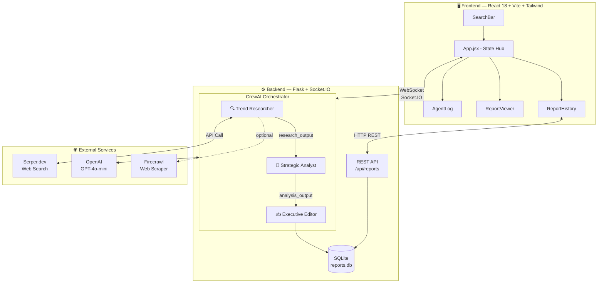
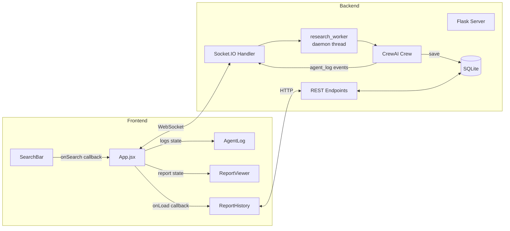
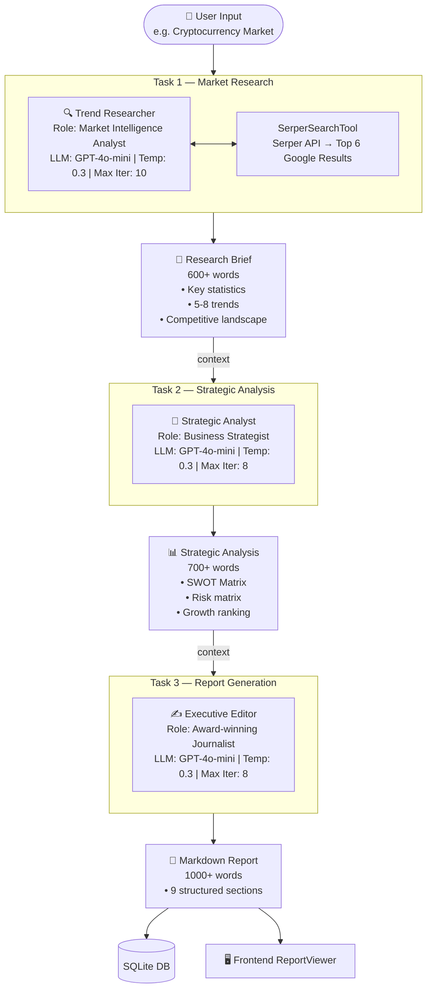
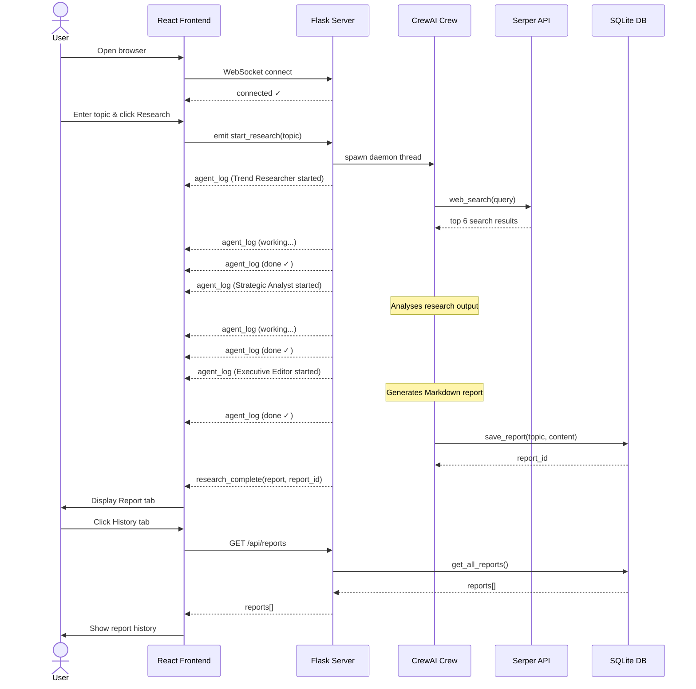

# Synapse — System Design Document

> Agentic AI Market Research System

> **VS Code tip:** Install the [Markdown Preview Mermaid Support](https://marketplace.visualstudio.com/items?itemName=bierner.markdown-mermaid) extension, then press `Ctrl+Shift+V` to see all Mermaid diagrams rendered live.

---

## 1. High-Level Architecture

```
╔══════════════════════════════════════════════════════════════════════════════╗
║                          SYNAPSE SYSTEM OVERVIEW                            ║
╠══════════════════════════════════════════════════════════════════════════════╣
║                                                                              ║
║  ┌─────────────────────────────────────────────────────────────────────┐    ║
║  │                        PRESENTATION LAYER                           │    ║
║  │                    React 18 + Vite + Tailwind CSS                   │    ║
║  │                                                                     │    ║
║  │  ┌──────────────┐  ┌──────────────┐  ┌──────────────┐  ┌────────┐  │    ║
║  │  │  SearchBar   │  │  AgentLog    │  │ReportViewer  │  │History │  │    ║
║  │  │  (Input UI)  │  │ (Live Logs)  │  │ (MD Render)  │  │  Tab   │  │    ║
║  │  └──────┬───────┘  └──────▲───────┘  └──────▲───────┘  └───┬────┘  │    ║
║  │         │                 │                  │              │       │    ║
║  │         └─────────────────┼──────────────────┼──────────────┘       │    ║
║  │                    App.jsx (State Hub)        │                      │    ║
║  └─────────────────────────┬─────────────────────┼──────────────────────┘    ║
║                            │                     │                           ║
║                   WebSocket (Socket.IO)      REST HTTP                       ║
║                            │                     │                           ║
║  ┌─────────────────────────▼─────────────────────▼──────────────────────┐    ║
║  │                         APPLICATION LAYER                            │    ║
║  │                    Flask + Flask-SocketIO                            │    ║
║  │                                                                      │    ║
║  │   ┌──────────────────────────────────────────────────────────────┐   │    ║
║  │   │                 CrewAI Orchestrator                          │   │    ║
║  │   │                                                              │   │    ║
║  │   │  ┌──────────────┐     ┌──────────────┐     ┌─────────────┐  │   │    ║
║  │   │  │    Trend     │────▶│  Strategic   │────▶│  Executive  │  │   │    ║
║  │   │  │  Researcher  │     │   Analyst    │     │   Editor    │  │   │    ║
║  │   │  │              │     │              │     │             │  │   │    ║
║  │   │  │ [web_search] │     │  [No Tools]  │     │ [No Tools]  │  │   │    ║
║  │   │  └──────┬───────┘     └──────┬───────┘     └──────┬──────┘  │   │    ║
║  │   │         │  research_output   │  analysis_output   │ report  │   │    ║
║  │   └─────────┼───────────────────┼────────────────────┼─────────┘   │    ║
║  │             │                   │                    │             │    ║
║  └─────────────┼───────────────────┼────────────────────┼─────────────┘    ║
║                │                   │                    │                   ║
║  ┌─────────────▼──┐    ┌───────────▼───────┐  ┌────────▼─────────────────┐  ║
║  │  EXTERNAL APIs │    │  INTELLIGENCE     │  │  PERSISTENCE LAYER       │  ║
║  │                │    │                  │  │                           │  ║
║  │  Serper.dev    │    │  OpenAI GPT-4o   │  │  SQLite Database          │  ║
║  │  (Web Search)  │    │  (LLM Backbone)  │  │  (Report History)         │  ║
║  └────────────────┘    └──────────────────┘  └───────────────────────────┘  ║
║                                                                              ║
╚══════════════════════════════════════════════════════════════════════════════╝
```

### Mermaid Version



---

## 2. Component Interaction Diagram

```
┌─────────────────────────────────────────────────────────────────────────────┐
│                       COMPONENT INTERACTION MAP                             │
└─────────────────────────────────────────────────────────────────────────────┘

  Frontend Components                    Backend Components
  ─────────────────────                  ────────────────────────────────────

  ┌───────────┐                          ┌───────────────────────────────────┐
  │  App.jsx  │◄─── Socket Events ──────►│         Flask Server              │
  │           │                          │  ┌─────────────────────────────┐  │
  │  State:   │◄─── REST /api/* ────────►│  │    REST API Endpoints       │  │
  │  socket   │                          │  │  GET /api/health            │  │
  │  logs[]   │                          │  │  GET /api/reports           │  │
  │  report   │                          │  │  GET /api/reports/<id>      │  │
  │  theme    │                          │  └─────────────────────────────┘  │
  │  activeTab│                          │  ┌─────────────────────────────┐  │
  └─────┬─────┘                          │  │   Socket.IO Event Handlers  │  │
        │                               │  │  on: connect                │  │
        │ passes props                   │  │  on: start_research         │  │
        ▼                               │  │  emit: agent_log            │  │
  ┌───────────────────────────────┐      │  │  emit: research_complete    │  │
  │       Child Components        │      │  │  emit: research_error       │  │
  │                               │      │  └─────────────────────────────┘  │
  │  ┌────────────┐               │      │  ┌─────────────────────────────┐  │
  │  │ SearchBar  │ onSearch()    │      │  │   research_worker()         │  │
  │  │            ├──────────────►├──────┼─►│   (daemon thread)           │  │
  │  └────────────┘               │      │  └──────────────┬──────────────┘  │
  │                               │      │                 │                 │
  │  ┌────────────┐               │      │                 ▼                 │
  │  │  AgentLog  │◄── logs[] ───┤      │  ┌─────────────────────────────┐  │
  │  │            │               │      │  │    CrewAI Research Crew     │  │
  │  └────────────┘               │      │  │                             │  │
  │                               │      │  │  Task 1 → Task 2 → Task 3   │  │
  │  ┌──────────────┐             │      │  └─────────────────────────────┘  │
  │  │ ReportViewer │◄─ report ──┤      │                                   │
  │  │  (markdown)  │             │      │  ┌─────────────────────────────┐  │
  │  └──────────────┘             │      │  │      SQLite Database         │  │
  │                               │      │  │  save_report()              │  │
  │  ┌───────────────┐            │      │  │  get_all_reports()          │  │
  │  │ ReportHistory │◄─ REST ───►├──────┼─►│  get_report_by_id()         │  │
  │  │               │            │      │  └─────────────────────────────┘  │
  │  └───────────────┘            │      └───────────────────────────────────┘
  └───────────────────────────────┘
```

### Mermaid Version



---

## 3. Agent Pipeline (CrewAI Sequential Flow)

```
┌─────────────────────────────────────────────────────────────────────────────┐
│                        CREWAI AGENT PIPELINE                                │
└─────────────────────────────────────────────────────────────────────────────┘

  User Input: "Cryptocurrency Market"
        │
        ▼
  ┌─────────────────────────────────────────────────────────────────────────┐
  │  TASK 1 — Market Research                                               │
  │  ┌────────────────────────────────────────────────────────────────┐    │
  │  │ TREND RESEARCHER                                                │    │
  │  │ Role: Market Intelligence Analyst (15 years exp)               │    │
  │  │ LLM: GPT-4o-mini  │  Temp: 0.3  │  Max Iter: 10               │    │
  │  │                                                                 │    │
  │  │  Input: Research topic from user                               │    │
  │  │  Tools: SerperSearchTool                                        │    │
  │  │          └─► Serper API → Google Search Results (top 6)       │    │
  │  │                                                                 │    │
  │  │  Output: Research brief (600+ words)                           │    │
  │  │    ├─ Key market statistics                                    │    │
  │  │    ├─ 5–8 emerging trends                                      │    │
  │  │    ├─ Competitive landscape                                    │    │
  │  │    ├─ Market segments                                          │    │
  │  │    └─ Recent innovations                                       │    │
  │  └────────────────────────────────┬───────────────────────────────┘    │
  └───────────────────────────────────┼─────────────────────────────────────┘
                                      │ research_output (context)
                                      ▼
  ┌─────────────────────────────────────────────────────────────────────────┐
  │  TASK 2 — Strategic Analysis                                            │
  │  ┌────────────────────────────────────────────────────────────────┐    │
  │  │ STRATEGIC ANALYST                                               │    │
  │  │ Role: Business Strategist (MBA, Fortune 500 Advisor)           │    │
  │  │ LLM: GPT-4o-mini  │  Temp: 0.3  │  Max Iter: 8                │    │
  │  │                                                                 │    │
  │  │  Input: Task 1 research output (via context chain)             │    │
  │  │  Tools: None (pure LLM reasoning)                              │    │
  │  │                                                                 │    │
  │  │  Output: Strategic analysis (700+ words)                       │    │
  │  │    ├─ SWOT Matrix (4–6 points per quadrant)                   │    │
  │  │    ├─ Risk matrix                                              │    │
  │  │    ├─ Growth opportunity ranking                               │    │
  │  │    ├─ Competitive positioning                                  │    │
  │  │    └─ Key strategic insights                                   │    │
  │  └────────────────────────────────┬───────────────────────────────┘    │
  └───────────────────────────────────┼─────────────────────────────────────┘
                                      │ analysis_output (context)
                                      ▼
  ┌─────────────────────────────────────────────────────────────────────────┐
  │  TASK 3 — Report Generation                                             │
  │  ┌────────────────────────────────────────────────────────────────┐    │
  │  │ EXECUTIVE EDITOR                                                │    │
  │  │ Role: Award-winning Journalist (ex-McKinsey Quarterly Editor)  │    │
  │  │ LLM: GPT-4o-mini  │  Temp: 0.3  │  Max Iter: 8                │    │
  │  │                                                                 │    │
  │  │  Input: Task 1 + Task 2 outputs (via context chain)            │    │
  │  │  Tools: None (pure LLM generation)                             │    │
  │  │                                                                 │    │
  │  │  Output: Professional Markdown Report (1000+ words)            │    │
  │  │    ├─ Executive Summary                                        │    │
  │  │    ├─ Market Overview                                          │    │
  │  │    ├─ Key Trends                                               │    │
  │  │    ├─ SWOT Analysis                                            │    │
  │  │    ├─ Competitive Landscape                                    │    │
  │  │    ├─ Growth Opportunities                                     │    │
  │  │    ├─ Risk Assessment                                          │    │
  │  │    ├─ Strategic Recommendations                                │    │
  │  │    └─ Conclusion                                               │    │
  │  └────────────────────────────────────────────────────────────────┘    │
  └─────────────────────────────────────────────────────────────────────────┘
                                      │
                                      ▼
                         Final Markdown Report
                         saved to SQLite + sent to Frontend
```

### Mermaid Version



---

## 4. Real-Time Data Flow (Sequence Diagram)

```
┌──────────┐    ┌──────────┐    ┌──────────┐    ┌──────────┐    ┌──────────┐
│  User    │    │ Frontend │    │  Flask   │    │  CrewAI  │    │  Serper  │
│ Browser  │    │  App.jsx │    │  Server  │    │   Crew   │    │   API    │
└────┬─────┘    └────┬─────┘    └────┬─────┘    └────┬─────┘    └────┬─────┘
     │               │               │               │               │
     │  open browser │               │               │               │
     │──────────────►│               │               │               │
     │               │  connect WS   │               │               │
     │               │──────────────►│               │               │
     │               │  connected ✓  │               │               │
     │               │◄──────────────│               │               │
     │               │               │               │               │
     │  enter topic  │               │               │               │
     │──────────────►│               │               │               │
     │               │ start_research│               │               │
     │               │  (WS event)   │               │               │
     │               │──────────────►│               │               │
     │               │               │  spawn thread │               │
     │               │               │──────────────►│               │
     │               │               │               │               │
     │               │  agent_log    │               │  web_search() │
     │               │◄──────────────│◄──────────────│──────────────►│
     │               │ (Researcher   │ (Trend        │               │
     │               │   started)    │  Researcher   │  results JSON │
     │               │               │   working)    │◄──────────────│
     │               │               │               │               │
     │               │  agent_log    │               │               │
     │               │◄──────────────│◄──────────────│               │
     │               │  (working...)  │ emit logs     │               │
     │               │               │               │               │
     │               │  agent_log    │               │               │
     │               │◄──────────────│◄──────────────│               │
     │               │  (done ✓)     │               │               │
     │               │               │               │               │
     │               │  agent_log    │               │               │
     │               │◄──────────────│◄──────────────│               │
     │               │ (Analyst      │ (Strategic    │               │
     │               │   started)    │  Analyst      │               │
     │               │               │   working)    │               │
     │               │  agent_log    │               │               │
     │               │◄──────────────│◄──────────────│               │
     │               │  (done ✓)     │               │               │
     │               │               │               │               │
     │               │  agent_log    │               │               │
     │               │◄──────────────│◄──────────────│               │
     │               │  (Editor      │ (Executive    │               │
     │               │   working)    │  Editor done) │               │
     │               │               │               │               │
     │               │               │  save to DB   │               │
     │               │               │──────────────►│               │
     │               │               │  report_id    │               │
     │               │               │◄──────────────│               │
     │               │               │               │               │
     │               │research_compl.│               │               │
     │               │◄──────────────│               │               │
     │               │(report + id)  │               │               │
     │               │               │               │               │
     │  view report  │               │               │               │
     │◄──────────────│               │               │               │
     │               │               │               │               │
     │  export .md   │               │               │               │
     │──────────────►│               │               │               │
     │  download     │               │               │               │
     │◄──────────────│               │               │               │
     │               │               │               │               │
     │  history tab  │               │               │               │
     │──────────────►│  GET /api/    │               │               │
     │               │  reports      │               │               │
     │               │──────────────►│               │               │
     │               │  reports[]    │               │               │
     │               │◄──────────────│               │               │
     │  see history  │               │               │               │
     │◄──────────────│               │               │               │
└────┴─────┘    └────┴─────┘    └────┴─────┘    └────┴─────┘    └────┴─────┘
```

### Mermaid Version



---

## 5. Database Schema

```
┌─────────────────────────────────────────────────────────────────┐
│                      SQLite: reports.db                         │
├─────────────────────────────────────────────────────────────────┤
│  Table: reports                                                 │
├──────────┬──────────┬──────────────┬────────────────────────────┤
│  Column  │  Type    │  Constraint  │  Description               │
├──────────┼──────────┼──────────────┼────────────────────────────┤
│  id      │ INTEGER  │ PRIMARY KEY  │  Auto-increment ID         │
│          │          │ AUTOINCREMENT│                            │
├──────────┼──────────┼──────────────┼────────────────────────────┤
│  topic   │ TEXT     │ NOT NULL     │  User's research topic     │
├──────────┼──────────┼──────────────┼────────────────────────────┤
│  content │ TEXT     │ NOT NULL     │  Full Markdown report      │
├──────────┼──────────┼──────────────┼────────────────────────────┤
│ created_at│ TEXT    │ NOT NULL     │  ISO 8601 timestamp        │
└──────────┴──────────┴──────────────┴────────────────────────────┘

  DB Operations:
  ┌─────────────────────────────────────────────────────────────┐
  │  save_report(topic, content)   → report_id                  │
  │  get_all_reports()             → [{id, topic, created_at}]  │
  │  get_report_by_id(id)          → {id, topic, content, ...}  │
  └─────────────────────────────────────────────────────────────┘
```

---

## 6. Technology Stack Summary

```
┌─────────────────────────────────────────────────────────────────────────────┐
│                           TECHNOLOGY STACK                                  │
├─────────────────────┬───────────────────────────────────────────────────────┤
│  Layer              │  Technology                                           │
├─────────────────────┼───────────────────────────────────────────────────────┤
│  Frontend UI        │  React 18 + Vite + Tailwind CSS                      │
├─────────────────────┼───────────────────────────────────────────────────────┤
│  Markdown Render    │  react-markdown + remark-gfm                         │
├─────────────────────┼───────────────────────────────────────────────────────┤
│  Real-time Comms    │  Socket.IO (WebSocket protocol)                      │
├─────────────────────┼───────────────────────────────────────────────────────┤
│  Backend Server     │  Flask + Flask-SocketIO                              │
├─────────────────────┼───────────────────────────────────────────────────────┤
│  Multi-Agent AI     │  CrewAI (sequential pipeline)                        │
├─────────────────────┼───────────────────────────────────────────────────────┤
│  LLM Intelligence   │  OpenAI GPT-4o-mini                                  │
├─────────────────────┼───────────────────────────────────────────────────────┤
│  Web Search         │  Serper.dev API (Google Search)                      │
├─────────────────────┼───────────────────────────────────────────────────────┤
│  Web Scraping       │  Firecrawl API (configured, optional)                │
├─────────────────────┼───────────────────────────────────────────────────────┤
│  Persistence        │  SQLite (embedded, file-based)                       │
├─────────────────────┼───────────────────────────────────────────────────────┤
│  Threading          │  Python threading (daemon thread per research job)   │
└─────────────────────┴───────────────────────────────────────────────────────┘
```

---

## 7. Key Design Decisions

```
┌─────────────────────────────────────────────────────────────────────────────┐
│  DESIGN DECISION          │  CHOICE               │  REASON                │
├───────────────────────────┼───────────────────────┼────────────────────────┤
│  Agent Communication      │  Sequential (CrewAI)  │  Each agent builds on  │
│                           │  not parallel         │  prior agent's output  │
├───────────────────────────┼───────────────────────┼────────────────────────┤
│  Real-time Updates        │  WebSocket (Socket.IO)│  Push model; avoids   │
│                           │  not polling          │  repeated HTTP polls   │
├───────────────────────────┼───────────────────────┼────────────────────────┤
│  Background Processing    │  Daemon Thread        │  Keeps Flask responsive│
│                           │  not async/await      │  while agents run      │
├───────────────────────────┼───────────────────────┼────────────────────────┤
│  Persistence              │  SQLite               │  Zero-config; sufficient│
│                           │  not PostgreSQL       │  for single-user system│
├───────────────────────────┼───────────────────────┼────────────────────────┤
│  Tool Access              │  Only Trend Researcher│  Search is only needed │
│                           │  has web_search       │  at the data-gathering │
│                           │                       │  stage                 │
├───────────────────────────┼───────────────────────┼────────────────────────┤
│  LLM Temperature          │  0.3 for all agents   │  Consistent, factual   │
│                           │                       │  outputs over creative │
└───────────────────────────┴───────────────────────┴────────────────────────┘
```

---

## 8. System Boundaries & External Dependencies

```
                    ┌─────────────────────────────┐
                    │   SYNAPSE SYSTEM BOUNDARY    │
                    │                             │
  ┌──────────┐      │  ┌──────────┐ ┌──────────┐  │      ┌──────────────┐
  │  User's  │◄────►│  │ React    │ │  Flask   │  │◄────►│ OpenAI API   │
  │ Browser  │      │  │ Frontend │ │ Backend  │  │      │ (GPT-4o-mini)│
  └──────────┘      │  └──────────┘ └──────────┘  │      └──────────────┘
                    │         │          │          │
                    │         │          │          │      ┌──────────────┐
                    │         └──── DB ──┘          │◄────►│  Serper.dev  │
                    │          SQLite               │      │ (Web Search) │
                    │                             │      └──────────────┘
                    │                             │
                    │                             │      ┌──────────────┐
                    │                             │◄────►│  Firecrawl   │
                    │                             │      │  (optional)  │
                    └─────────────────────────────┘      └──────────────┘

  Ports:
    Frontend  →  http://localhost:3000
    Backend   →  http://localhost:5000
    WebSocket →  ws://localhost:5000 (Socket.IO)
```
